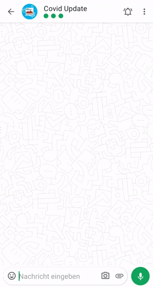

# Der D64 Covidbot
Ein Bot zu Deinen Diensten: Unser Covidbot versorgt Dich einmal am Tag mit den aktuellen Infektions-, Todes- und Impfzahlen der von Dir ausgewählten Orte.
Abonniere ihn einfach in Deinem Lieblingsmessenger, indem Du den Telegram-Bot startest oder bei Signal oder Threema eine Nachricht mit "Start" schickst, nachdem Du den Bot als Kontakt hinzugefügt hast.
[Telegram](https://t.me/CovidInzidenzBot) | [Threema](https://threema.id/*COVINFO?text=Start) | Signal (Beta): Füge +4915792453845 als Kontakt hinzu.
[https://covidbot.d-64.org](https://covidbot.d-64.org)

## Features
* Jederzeit aktuelle Infektionszahlen für alle Orte in Deutschland mit Grafik
* Morgens ein täglicher Bericht mit den abonnierten Orten
* R-Wert und Impfdaten

## Demo



## Installation
### Voraussetzungen
Unterschiedlich, je nach Messengern die eingesetzt werden. Es wird immer min. Python3.8 benötigt, sowie eine MySQL Datenbank.

### Installation
Kopiere die Default-Config Datei und passe `config.ini` an. Wenn du einen Messenger nicht nutzen möchtest, muss der Config Teil nicht existieren.
Immer benötigt wird `[DATABASE]`.
`cp resources/config.default.ini config.ini` 

Anschließend müssen die Requirements installiert werden.
`pip install -r requirements.txt`

Benutzung des Bots:
```shell
$ python -m covidbot --help
usage: python -m covidbot

optional arguments:
  -h, --help            show this help message and exit
  --verbose, -v
  --config CONFIG_FILE, -c CONFIG_FILE
  --platform {threema,telegram,signal,shell}
                        Platform that should be used
  --check-updates       Run platform independent jobs, such as checking for new data
  --daily-report        Send daily reports if available, requires --platform
  --message-user        Send a message to users
  --file MESSAGE_FILE   Message, requires --message-user
  --all                 Intended receivers, requires --platform
  --specific USER [USER ...]
                        Intended receivers, requires --platform
```

Mit `python -m covidbot --platform shell` kann man den Bot im Shell Modus starten.
Es läuft komplett im Terminal und ist gut geeignet, um etwas ohne Messenger Zugang zu testen:
```shell
$ python -m covidbot --platform shell
Please enter input:
> Start
Hallo,
über diesen Bot kannst Du Dir die vom Robert-Koch-Institut (RKI) bereitgestellten COVID19-Daten anzeigen lassen und sie dauerhaft kostenlos abonnieren. Einen Überblick über alle Befehle erhältst du über "Hilfe".

Schicke einfach eine Nachricht mit dem Ort, für den Du Informationen erhalten möchtest. Der Ort kann entweder ein Bundesland oder ein Stadt-/ Landkreis sein. Du kannst auch einen Standort senden! Wenn die Daten des Ortes nur gesammelt für eine übergeordneten Landkreis oder eine Region vorliegen, werden dir diese vorgeschlagen. Du kannst beliebig viele Orte abonnieren und unabhängig von diesen  auch die aktuellen Zahlen für andere Orte ansehen.
> Daten Berlin
𝗕𝗲𝗿𝗹𝗶𝗻

🏥 𝗜𝗻𝗳𝗲𝗸𝘁𝗶𝗼𝗻𝘀𝗱𝗮𝘁𝗲𝗻
Die 7-Tage-Inzidenz (Anzahl der Infektionen je 100.000 Einwohner:innen) liegt bei 57,36 ↗.

Neuinfektionen (seit gestern): Keine Daten 
Infektionen seit Ausbruch der Pandemie: 124.518

Neue Todesfälle (seit gestern): Keine Daten 
Todesfälle seit Ausbruch der Pandemie: 2.598

💉 𝗜𝗺𝗽𝗳𝗱𝗮𝘁𝗲𝗻
3,49% der Bevölkerung haben mindestens eine Impfung erhalten, 1,86% sind  - Stand 13.02.2021 - vollständig geimpft.

Verabreichte Erstimpfdosen: 127.951
Verabreichte Zweitimpfdosen: 68.363

𝘐𝘯𝘧𝘦𝘬𝘵𝘪𝘰𝘯𝘴𝘥𝘢𝘵𝘦𝘯 𝘷𝘰𝘮 13.02.2021
𝘋𝘢𝘵𝘦𝘯 𝘷𝘰𝘮 𝘙𝘰𝘣𝘦𝘳𝘵 𝘒𝘰𝘤𝘩-𝘐𝘯𝘴𝘵𝘪𝘵𝘶𝘵 (𝘙𝘒𝘐), 𝘓𝘪𝘻𝘦𝘯𝘻: 𝘥𝘭-𝘥𝘦/𝘣𝘺-2-0, 𝘸𝘦𝘪𝘵𝘦𝘳𝘦 𝘐𝘯𝘧𝘰𝘳𝘮𝘢𝘵𝘪𝘰𝘯𝘦𝘯 𝘧𝘪𝘯𝘥𝘦𝘴𝘵 𝘋𝘶 𝘪𝘮 𝘋𝘢𝘴𝘩𝘣𝘰𝘢𝘳𝘥 𝘥𝘦𝘴 𝘙𝘒𝘐 (https://corona.rki.de/) 𝘶𝘯𝘥 𝘥𝘦𝘮 𝘐𝘮𝘱𝘧𝘥𝘢𝘴𝘩𝘣𝘰𝘢𝘳𝘥 (https://impfdashboard.de/). 𝘚𝘦𝘯𝘥𝘦 "𝘐𝘯𝘧𝘰" 𝘶𝘮 𝘦𝘪𝘯𝘦 𝘌𝘳𝘭𝘢̈𝘶𝘵𝘦𝘳𝘶𝘯𝘨 𝘥𝘦𝘳 𝘋𝘢𝘵𝘦𝘯 𝘻𝘶 𝘦𝘳𝘩𝘢𝘭𝘵𝘦𝘯.
```

### Cronjobs einrichten
Unser Bot verlässt sich darauf, dass er regelmäßig mit Flags gestartet wird um
* Daten zu updaten (`--check-updates`)
* Berichte zu versenden (`--platform PLATFORM --daily-report`)

Es kann zu Problemen kommen, wenn der Update Prozess oder der Report Prozess eines einzelnen Messengers parallel läuft.
Um das zu verhindern, nutzen wir Lockfiles mit Flock.

```shell
# Data Update
*/15 * * * * /usr/bin/env bash -c 'cd /home/covidbot/covid-bot && source venv/bin/activate && /usr/bin/flock -n resources/tmp/data-update.lock python -m covidbot --check-updates'

# Messenger
*/15 * * * * /usr/bin/env bash -c 'cd /home/covidbot/covid-bot && source venv/bin/activate && /usr/bin/flock -n resources/tmp/signal-reports.lock python -m covidbot --daily-report --platform signal'
*/15 * * * * /usr/bin/env bash -c 'cd /home/covidbot/covid-bot && source venv/bin/activate && /usr/bin/flock -n resources/tmp/threema-reports.lock python -m covidbot --daily-report --platform threema'
*/15 * * * * /usr/bin/env bash -c 'cd /home/covidbot/covid-bot && source venv/bin/activate && /usr/bin/flock -n resources/tmp/telegram-reports.lock python -m covidbot --daily-report --platform telegram'
```

## Architektur


## Credits
Die Informationen über die Corona-Infektionen werden von der offiziellen Schnittstelle des RKI für [Landkreise](https://hub.arcgis.com/datasets/917fc37a709542548cc3be077a786c17_0) und [Bundesländer](https://npgeo-corona-npgeo-de.hub.arcgis.com/datasets/ef4b445a53c1406892257fe63129a8ea_0) abgerufen und stehen unter der Open Data Datenlizenz Deutschland – Namensnennung – Version 2.0.
Weitere Informationen sind auch im [Dashboard des RKI](https://corona.rki.de/) sowie dem [NPGEO Corona Hub 2020](https://npgeo-corona-npgeo-de.hub.arcgis.com/) zu finden.

Welche Bibliotheken und andere Dienste wir noch verwenden, kannst Du unter [Credits](https://github.com/eknoes/covid-bot/wiki/Credits) im Wiki einsehen.

## Ein Projekt von D64 - Zentrum für Digitalen Fortschritt
D64 versteht sich als Denkfabrik des digitalen Wandels. Wir sind von der gesamtgesellschaftlichen Auswirkung des Internets auf sämtliche Bereiche des öffentlichen und privaten Lebens überzeugt. D64 will Taktgeber und Ratgeber für die Politik sein, um Deutschland für die digitale Demokratie aufzustellen. Leitgedanke des Vereins ist die Frage, wie das Internet dazu beitragen kann, eine gerechte Gesellschaft zu fördern. Wir finanzieren uns ausschließlich durch Mitgliedsbeiträge. [Werde Mitglied und hilf mit, das Internet freier, gerechter und solidarischer zu machen!](https://d-64.org/mitglied-werden/)

[Datenschutzerklärung](https://github.com/eknoes/covid-bot/wiki/Datenschutz) | [Impressum](https://github.com/eknoes/covid-bot/wiki/Impressum)
